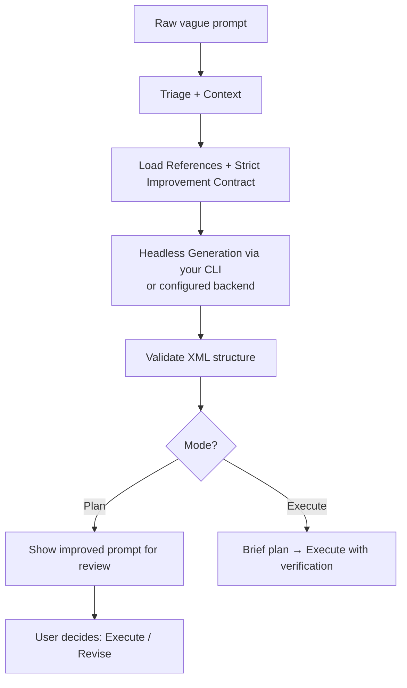

# prompt-improver

**Transform vague prompts into precise, verifiable, structured XML prompts that coding agents execute reliably — with no special preambles required.**

[](https://github.com/owenob1/prompt-improver/actions/workflows/ci.yml)
[](LICENSE.txt)
[](#cli-compatibility)
[](#configuration-settingsjson)

prompt-improver is a portable skill and set of prompting principles that takes rough user intent and turns it into high-quality, executable specifications. It works across major coding CLI agents — both with strong headless support and without.

A strict **improvement-only contract** is built into the generator so you can call it with a simple prompt and it will not start executing the work inside your request.

## Table of Contents

- [Why it works](#why-it-works)
- [Install](#install)
- [Quickstart](#quickstart)
- [Global Improvement Guard](#global-improvement-guard-no-preambles-needed)
- [Modes](#modes)
- [How it works](#how-it-works)
- [Configuration (settings.json)](#configuration-settingsjson)
- [CLI compatibility](#cli-compatibility)
- [Verification / smoke tests](#verification--smoke-tests)
- [Project structure](#project-structure)
- [Contributing](#contributing)
- [License](#license)

## Why it works

It systematically applies battle-tested prompting techniques:

- **Verification + self-check** at every step (highest leverage)
- Few-shot examples with reasoning (the most effective steering technique)
- `<approach>` blocks for think-then-commit reasoning
- Explicit `<escape>` clauses so agents flag problems instead of silently failing
- Task-specific constraints instead of generic boilerplate
- Data-first ordering and concrete specifications
- Strict validation of generated prompts

These patterns are documented in `references/` and demonstrated in `examples/before-after.md`.

## Install

### As a skill (Claude Code / Grok Build / skill-compatible agents)

Clone or copy this repository into your agent's skills directory:

```bash
# Claude Code (example)
git clone https://github.com/owenob1/prompt-improver.git ~/.claude/skills/prompt-improver

# Grok Build (example)
git clone https://github.com/owenob1/prompt-improver.git ~/.grok/skills/prompt-improver
```

Then invoke with the skill slash command (exact trigger depends on the host):

```text
/prompt-improver plan "your vague request here"
/prompt-improver "your vague request here"
```

### As standalone scripts (any shell + a coding CLI)

```bash
git clone https://github.com/owenob1/prompt-improver.git
cd prompt-improver
bash scripts/smoke-test.sh          # optional: offline checks
bash scripts/standalone-improve.sh "Add rate limiting to the API" plan
```

No Node/Python runtime is required for the core scripts — only `bash` (and optionally `jq` for richer settings parsing).

## Quickstart

### 1. Portable: assemble materials, then call any CLI

```bash
PROMPT=$(bash scripts/assemble-generation-prompt.sh "Add rate limiting to the API")

claude -p "$PROMPT"
# or
gemini -p "$PROMPT"
# or
grok -p "$PROMPT"
```

### 2. One-shot generator (auto-detects backend)

```bash
bash scripts/generate-prompt.sh \
  --mode plan \
  --raw-input "Refactor the auth module to use JWT with refresh tokens"
```

Force a backend:

```bash
PROMPT_IMPROVER_BACKEND=claude bash scripts/generate-prompt.sh \
  --mode plan \
  --raw-input "Add retries and idempotency keys to payment webhooks"
```

If no headless CLI is available (or headless fails), the default `fallback_strategy` is `manual`: the assembled generator prompt is printed so you can paste it into any agent.

### 3. Validate a generated prompt

```bash
bash scripts/validate-prompt.sh path/to/improved-prompt.xml
# or
echo "$IMPROVED" | bash scripts/validate-prompt.sh
```

### 4. Interactive (no headless mode)

Paste the contents of `references/`, `examples/before-after.md`, and `assets/generation-agent-prompt.md` into any capable agent, then add:

```text
Improve this request (do not execute it): <your vague request>
```

## Global Improvement Guard (No Preambles Needed)

Unlike raw prompts that can cause agents to immediately start building, prompt-improver uses a strict **IMPROVEMENT-ONLY** contract:

- The generator is instructed to treat your request as **data only**.
- It will **not** execute, code, or plan the work inside your raw prompt.
- Output is always the improved structured XML (ready for review in Plan mode or safe execution).

This works across CLIs because the contract lives in the reference materials and generator instructions, not in your input.

You can call it cleanly:

```bash
/prompt-improver "Add rate limiting and retries to the payment service"
```

No "DO NOT EXECUTE" wrappers required from you.

## Modes

| Mode | Invocation | What happens |
|------|------------|--------------|
| **Execute** (default) | `/prompt-improver "..."` | Generate improved prompt internally, give a brief plan, then execute it. |
| **Plan** | `/prompt-improver plan "..."` | Generate the full structured XML prompt, show it for review, then let you decide (Execute / Revise / Edit / Discard). |

**Task mode is deprecated.** The previous integration with an external persistent task system is no longer active. The generator can still produce structured `<task>` blocks inside the XML when decomposition is useful.

## How it works



1. **Triage** the input (trivial / already good / rough / mixed).
2. Summarize conversation context.
3. Load reference materials (XML template, prompting principles, chaining guidance, before/after examples) plus the improvement-only contract.
4. A specialized generator (your chosen CLI headless, or configured backend) produces a high-quality XML prompt.
5. The prompt is validated (`scripts/validate-prompt.sh`).
6. You either review it (Plan) or it is executed with strong verification.

## Configuration (`settings.json`)

Settings are loaded in this order (later wins only for env vars; files use project → user → default):

1. Environment variables (`PROMPT_IMPROVER_*`) — **highest priority**
2. `.prompt-improver/settings.json` (project)
3. `~/.config/prompt-improver/settings.json` (user)
4. `config/settings.default.json` (shipped defaults)

Copy the example:

```bash
mkdir -p ~/.config/prompt-improver
cp config/settings.example.json ~/.config/prompt-improver/settings.json
```

Example:

```json
{
  "backend": "auto",
  "model": null,
  "max_tokens": 12000,
  "enable_research": true,
  "enable_thinking": true,
  "fallback_strategy": "manual",
  "preferred_backends": ["grok", "claude", "gemini", "cline", "opencode", "kimi", "kiro", "codex"]
}
```

| Setting | Meaning |
|---------|---------|
| `backend` | `auto` (recommended) or a specific adapter name |
| `fallback_strategy` | `manual` (print assembled prompt) or `error` (fail hard) |
| `max_tokens` | Soft limit guidance for the *improved* prompt size |
| `enable_research` / `enable_thinking` | Passed into generator instructions |
| `custom_command` | Full override for advanced users |
| `preferred_backends` | Order used when `backend` is `auto` |

Environment overrides:

```bash
export PROMPT_IMPROVER_BACKEND=claude
export PROMPT_IMPROVER_MODEL=claude-sonnet-4-20250514
export PROMPT_IMPROVER_FALLBACK_STRATEGY=manual
export PROMPT_IMPROVER_REQUIRE_TYPECHECK=0   # validate-prompt: 1 = typecheck hard-fails
```

## CLI compatibility

| CLI | Headless example | Adapter | Notes |
|-----|------------------|---------|-------|
| Grok Build | `grok -p "..."` | `backends/grok.sh` | Strong headless support |
| Claude Code | `claude -p "..."` | `backends/claude.sh` | Strong headless support |
| Gemini CLI | `gemini -p "..."` | `backends/gemini.sh` | Good for automation |
| Cline | `cline --headless` / `-p` | `backends/cline.sh` | Flags vary by version |
| OpenCode | `opencode -p` | `backends/opencode.sh` | Open source |
| Kimi | See kimi-code docs | `backends/kimi.sh` | MoonshotAI |
| Kiro | `kiro -p` / `--headless` | `backends/kiro.sh` | Flags vary by version |
| Codex | `codex exec` | `backends/codex.sh` | OpenAI Codex CLI |

**Adding a new backend**

1. Create `scripts/backends/mytool.sh` (executable; accept a prompt file path as `$1`).
2. Exit non-zero if the CLI is missing or the run fails.
3. Optionally add the name to `preferred_backends` in settings.

### Robustness

- **CLI loses headless support** → `fallback_strategy: manual` prints the assembled prompt.
- **Model availability** → set `model` (or `PROMPT_IMPROVER_MODEL`) to whatever your provider offers; we do not hardcode model catalogs.
- **Untyped / script repos** → `validate-prompt.sh` warns on missing typecheck by default; set `PROMPT_IMPROVER_REQUIRE_TYPECHECK=1` when you want a hard fail.

## Verification / smoke tests

Offline checks (no API keys, no paid CLIs):

```bash
bash scripts/smoke-test.sh
```

This validates:

- Shell syntax of all scripts
- Settings no longer clobber `SCRIPT_DIR` (backend discovery)
- Assembler embeds reference materials + improvement guard
- Validator accepts good fixtures and rejects bad ones
- CLI help / usage errors behave correctly

CI runs the same suite on every push and PR to `main` (see `.github/workflows/ci.yml`).

## Project structure

```
.
├── SKILL.md                      # Skill definition (modes, workflow)
├── README.md
├── CHANGELOG.md
├── CONTRIBUTING.md
├── TODO.md                       # Roadmap / remaining work
├── LICENSE.txt
├── config/
│   ├── settings.default.json
│   └── settings.example.json
├── assets/
│   └── generation-agent-prompt.md
├── examples/
│   ├── before-after.md
│   └── fixtures/                 # Validation fixtures for smoke tests
├── references/
│   ├── xml-template.md
│   ├── prompting-principles.md
│   └── prompt-chaining.md
├── scripts/
│   ├── generate-prompt.sh        # Main portable generator
│   ├── assemble-generation-prompt.sh
│   ├── validate-prompt.sh
│   ├── gather-context.sh
│   ├── standalone-improve.sh
│   ├── smoke-test.sh
│   ├── lib/settings.sh
│   └── backends/                 # Per-CLI headless adapters
└── .github/
    ├── workflows/ci.yml
    ├── ISSUE_TEMPLATE/
    └── PULL_REQUEST_TEMPLATE.md
```

## Contributing

See [CONTRIBUTING.md](CONTRIBUTING.md).

Before opening a PR:

```bash
bash scripts/smoke-test.sh
```

We care about:

- Preserving prompting principles and verification standards
- Portability across CLIs
- Clear, testable improvements
- The global improvement contract (no premature execution)

## License

MIT — see [LICENSE.txt](LICENSE.txt).

---

Made with the same rigor the skill itself teaches. Use it to make your agents dramatically more reliable.
