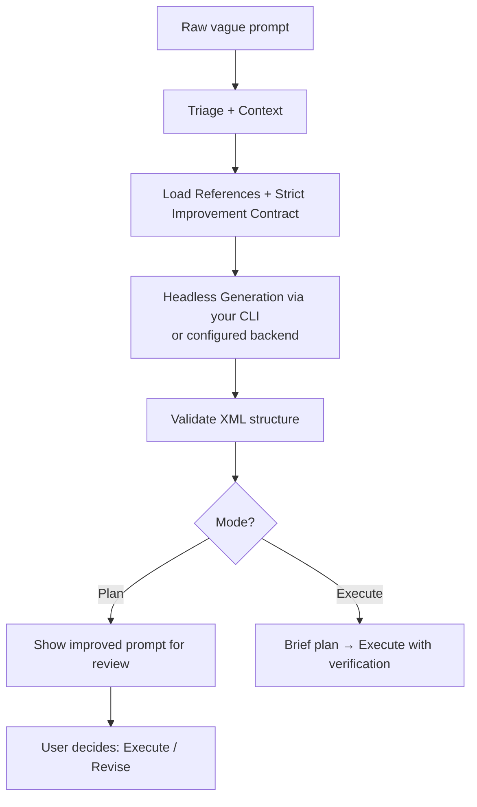

# prompt-improver

**Transform vague prompts into precise, verifiable, structured XML prompts that coding agents execute reliably — with no special preambles required.**

[](#broad-cli-compatibility)
[](#configuration-settingsjson)

prompt-improver is a portable skill and set of prompting principles that takes rough user intent and turns it into high-quality, executable specifications. It works across major coding CLI agents — both with strong headless support and without.

A strict **improvement-only contract** is built into the generator so you can call it with a simple prompt and it will not start executing the work inside your request.

## Table of Contents

- [Why it works](#why-it-works)
- [Quickstart](#quickstart)
- [Global Improvement Guard](#global-improvement-guard-no-preambles-needed)
- [Modes](#modes)
- [How it works](#how-it-works)
- [Configuration (settings.json)](#configuration-settingsjson)
- [Robustness considerations](#robustness-considerations)
- [Project structure](#project-structure)
- [Contributing](#contributing)
- [License](#license)

## Why it works

It systematically applies battle-tested prompting techniques:

- **Verification + self-check** at every step (highest leverage)
- Few-shot examples with reasoning (the most effective steering technique)
- `<approach>` blocks for think-then-commit reasoning
- Explicit `<escape>` clauses so agents flag problems instead of silently failing
- Task-specific constraints instead of generic boilerplate
- Data-first ordering and concrete specifications
- Strict validation of generated prompts

These patterns are documented in the `references/` and demonstrated in `examples/before-after.md`.

## Quickstart

### Using with Grok Build (this environment)

```bash
/prompt-improver plan "your vague request here"
# or just
/prompt-improver "your vague request here"
```

### Portable usage with any CLI (recommended for most agents)

We provide a small helper that assembles the generator instructions + all reference materials:

```bash
# Assemble once
PROMPT=$(bash scripts/assemble-generation-prompt.sh "Add rate limiting to the API")

# Then use with your favorite CLI
claude -p "$PROMPT"
gemini -p "$PROMPT"
grok -p "$PROMPT"
# etc.
```

### Using with Claude Code (headless)

```bash
claude -p "$(cat references/* examples/* assets/generation-agent-prompt.md) RAW INPUT: Add proper error handling and retries to the payment flow" --allowedTools "Read,Write,Edit,Bash"
```

### Using with Gemini CLI (headless)

```bash
gemini -p "$(cat references/* examples/* assets/generation-agent-prompt.md) RAW INPUT: Refactor the auth module to use JWT with refresh tokens" 
```

### Using with Cline, OpenCode, Kimi Code CLI, Kiro CLI, etc.

Most modern coding CLIs support a direct prompt / headless flag (`-p`, `--prompt`, `exec`, etc.). Feed them the core materials:

```bash
YOUR_CLI_HEADLESS_FLAG "$(cat references/xml-template.md references/prompting-principles.md references/prompt-chaining.md examples/before-after.md assets/generation-agent-prompt.md) 

Improve this request: <your original vague request>"
```

The generator will return a clean XML prompt you can then feed back to the same (or any other) agent.

**Non-headless / interactive use**: Paste the contents of the `references/` and `assets/generation-agent-prompt.md` files (plus your raw request) into any capable agent and ask it to act as the prompt improver.

## Global Improvement Guard (No Preambles Needed)

Unlike raw prompts that can cause agents to immediately start building, prompt-improver uses a strict "IMPROVEMENT-ONLY" contract:

- The generator is explicitly instructed to treat your request as **data only**.
- It will **never** execute, code, or plan the work inside your raw prompt.
- Output is always the improved structured XML (ready for review in Plan mode or safe execution).

This works across CLIs because the contract lives in the reference materials and generator instructions, not in your input.

You can call it cleanly:

```bash
/prompt-improver "Add rate limiting and retries to the payment service"
```

No "DO NOT EXECUTE" or special wrappers required from you.

## Modes

| Mode     | Invocation                  | What happens |
|----------|-----------------------------|--------------|
| **Execute** (default) | `/prompt-improver "..."`   | Generate improved prompt internally, give a brief plan, then execute it. |
| **Plan** | `/prompt-improver plan "..."` | Generate the full structured XML prompt, show it for review, then let you decide (Execute / Revise / Edit / Discard). |

**Task mode is deprecated.** The previous integration with an external persistent task system is no longer active. The underlying generator can still produce excellent structured `<task>` blocks inside the XML when decomposition is useful. You can request task-style output explicitly in your prompt.

## How it works



1. **Triage** the input (trivial / already good / rough / mixed).
2. Summarize conversation context.
3. Load the reference materials (XML template, prompting principles, chaining guidance, before/after examples) + strict "improvement-only" contract.
4. A specialized generator (delegated to your chosen CLI headless or configured backend) produces a high-quality XML prompt.
5. The prompt is validated (`scripts/validate-prompt.sh`).
6. You either review it (Plan) or it is executed with strong verification.

The heavy lifting of good prompting lives in the reference files so the same high standards apply no matter which CLI you use.

## Configuration (`settings.json`)

prompt-improver looks for settings in this order:

1. Environment variables (`PROMPT_IMPROVER_*`)
2. `.prompt-improver/settings.json` (project)
3. `~/.config/prompt-improver/settings.json` (user)
4. `config/settings.default.json` (shipped defaults)

Example `settings.json`:

```json
{
  "backend": "auto",
  "model": "claude-3-5-sonnet-20241022",
  "max_tokens": 8000,
  "enable_research": true,
  "enable_thinking": true,
  "fallback_strategy": "manual",
  "preferred_backends": ["grok", "claude", "gemini"]
}
```

**Important settings:**

- `backend`: `auto` (recommended) or force a specific one.
- `fallback_strategy`: what to do if the chosen CLI has no (or broken) headless mode.
  - `manual` (default) → print the assembled prompt for you to use manually.
  - `error` → fail hard.
- `max_tokens`: hard limit on the size of the *improved* prompt generated.
- `enable_research` / `enable_thinking`: passed into the generator prompt so it knows whether it can use tools or internal reasoning.

You can also set a completely custom command via `custom_command`.

## Robustness considerations

1. **CLI loses headless support**  
   The `fallback_strategy` setting controls this. By default we gracefully drop to "manual" mode and give you the full prompt to paste.

2. **Model availability**  
   We do not hardcode model lists. Use the `model` setting with whatever your chosen provider currently offers (e.g. `grok-4`, `gemini-2.5-pro`, `claude-3-5-sonnet-20241022`). "latest" aliases usually work when the CLI supports them.

3. **Output token limits**  
   Use `max_tokens` in settings. The generator will try to respect it.

4. **Fine-grained control**  
   We expose several toggles today (`enable_research`, `enable_thinking`, `max_tokens`, etc.). More will be added over time as the community requests them. All settings are designed to work regardless of which coding CLI you are using as the inference engine.

## Extensibility

### CLI Compatibility Table

| CLI          | Headless Flag Example          | Adapter     | Notes |
|--------------|--------------------------------|-------------|-------|
| Grok Build  | `grok -p "..."`               | grok.sh    | Preferred in this env |
| Claude Code | `claude -p "..."`             | claude.sh  | Strong support |
| Gemini CLI  | `gemini -p "..."`             | gemini.sh  | Good for automation |
| Cline       | `cline --headless`            | cline.sh   | Terminal + IDE |
| OpenCode    | `opencode ... --non-interactive` | opencode.sh | Open source |
| Kimi        | See kimi-code docs            | kimi.sh    | MoonshotAI |
| Kiro        | `kiro --headless`             | kiro.sh    | Fast CLI |
| Codex       | `codex exec` or custom        | codex.sh   | Placeholder |

### MCP & Standalone

- **MCP**: Generation and settings logic can be wrapped as MCP servers (local stdio for direct agent access or cloud-hosted). This allows other agents to call prompt-improver as a tool without being the host CLI.
- **Standalone**: `scripts/standalone-improve.sh` + `generate-prompt.sh` work outside agents. Set `PROMPT_IMPROVER_BACKEND` (and keys). A full standalone binary is a logical next step.

**New CLIs**: Drop a new executable in `scripts/backends/<name>.sh` that accepts a prompt file and outputs the improved result. Register it in settings or detection.

### Adding a new backend
1. Create `scripts/backends/mytool.sh`
2. Make executable
3. Test: `bash scripts/backends/mytool.sh <(echo "test raw input")`
4. Update preferred_backends in settings if desired.

## Project structure

```
.
├── SKILL.md                      # Main skill definition + mode docs
├── TODO.md                       # Public release backlog
├── README.md
├── CONTRIBUTING.md
├── LICENSE.txt
├── config/
│   ├── settings.default.json
│   └── settings.example.json
├── assets/
│   └── generation-agent-prompt.md
├── examples/
│   └── before-after.md
├── references/
│   ├── xml-template.md
│   ├── prompting-principles.md
│   └── prompt-chaining.md
├── scripts/
│   ├── generate-prompt.sh        # Main portable generator + settings
│   ├── assemble-generation-prompt.sh
│   ├── validate-prompt.sh
│   ├── gather-context.sh
│   ├── lib/settings.sh
│   └── backends/                 # Per-CLI headless adapters
│       ├── grok.sh
│       └── claude.sh
└── .github/                      # Contribution templates
```

## Contributing

See [CONTRIBUTING.md](CONTRIBUTING.md) for the full workflow.

We care deeply about:
- Preserving the prompting principles and verification standards
- Keeping the skill portable across CLIs
- Clear, testable improvements
- The global improvement contract (no premature execution)

## License

MIT — see LICENSE.txt.

---

Made with the same rigor the skill itself teaches. Use it to make your agents dramatically more reliable.